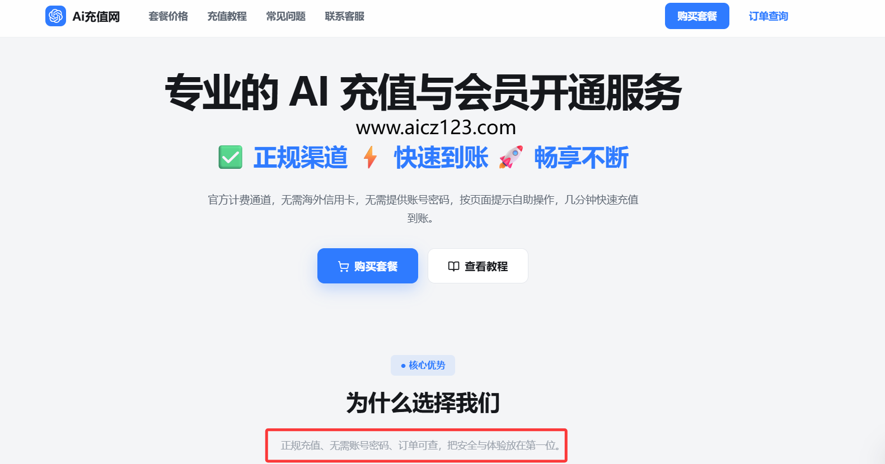

# 2026年最新ChatGPT Plus充值攻略：如何在国内充值 ChatGPT Plus

随着OpenAI发布GPT-5.4和新版Codex，ChatGPT Plus会员的功能得到了进一步增强。国内用户由于支付限制，开通会员需要特定的操作方法。目前主流的充值方式包括国内代充网站、虚拟信用卡、苹果App Store礼品卡以及淘宝共享账号。其中，代充网站因操作便捷且接近官方价格，成为许多用户的首选方案。本文将重点介绍这四种方法的对比，并详细梳理代充网站的具体操作流程。

## 01四大充值方式对比

| 充值方式 | 适用设备 | 特点 | 推荐指数 |
| :--- | :--- | :--- | :--- |
| 国内代充网站 | 全平台 | 操作最快，无需开卡，价格接近官网，找对网站无封号风险 | 高 |
| 虚拟信用卡 | 全平台 | 需自行注册和开卡，有一定操作门槛，存在风控封号风险 | 中 |
| 苹果App Store礼品卡 | 仅限iPhone/iPad | 需购买兑换卡，步骤相对繁琐，仅限苹果生态内使用 | 中 |
| 淘宝共享账号 | 全平台 | 价格低廉但安全性差，极易发生封号或数据泄露事故 | 低 |

## 02国内代充网站实操指南

使用代充网站开通会员通常仅需4步，全程无需繁琐的信用卡申请流程。以下是详细的操作指引，建议在Chrome浏览器电脑端进行操作。

1. **打开国内正规代充网站 [aicz123.com](aicz123.com)，选择合适的套餐。**
。
2. **购买完成之后，会给你一个卡密，复制卡密，点击核销。**
3. **按照网站提示步骤，一步一步完成操作，大约两分钟即可完成充值**
4. **完成充值并核实**

返回ChatGPT对话页面刷新或重新登录，头像下方出现“PLUS”字样即表示开通成功。

## 03常见问题与功能设置

* **什么是自助充值？卡密又是什么？**
* 自助充值是指你下单支付后，系统会发放一串充值凭证，这串凭证就叫卡密。你拿到卡密后，打开充值网站验证卡密，并在自己的浏览器里登录 OpenAI / ChatGPT 账号完成充值。整个过程不需要把账号密码发给客服。
* **充值方式安全吗？**

本服务通过 Apple App Store 内购订阅链路完成开通，安全稳定。非虚拟卡开通、非共享账号、非网页逆向、非账号池。
* **卡密可以重复使用或换账号使用吗？**

不可以。卡密通常只能绑定一个账号，充值前一定要核对账号邮箱。错绑、多绑或绑定到错误空间后，后台无法解绑。
* **使用卡密充值报错“卡密验证失败”怎么办？**

这通常是网络问题导致的临时验证失败，不代表卡密一定有问题。请刷新页面或重新打开充值网站，多重试几次通常就可以通过。
* **没到期可以继续充值吗？**

建议会员到期后再充值。卡密充值通常按充值当天重新计算周期，不是在原会员到期时间后顺延。例如今天是 6 月 5 日，你当前会员有效期是 5 月 15 日到 6 月 15 日，如果今天充值，新会员周期通常会变成 6 月 5 日到 7 月 5 日，而不是 6 月 15 日到 7 月 15 日。
* 若操作中遇到问题，可直接在购买网站联系客服（如下单页面的QQ号）寻求解决。

国内用户通过代充网站[www.aicz123.com](www.aicz123.com)开通ChatGPT Plus是目前较为高效且稳妥的途径。操作前请确保已登录官方账号，并严格按照步骤获取Token代码进行充值。成功开通后，用户即可使用GPT-5.4、新版Codex以及GPT images 1.5等高级功能。
